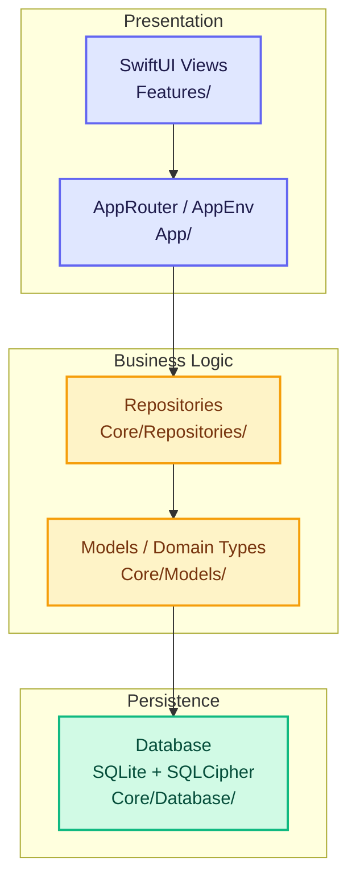

<div align="center">

# Avelo Accounting

**Offline-first, double-entry accounting for macOS — no cloud, no subscription, no compromise.**

[](https://www.apple.com/macos/)
[](https://swift.org)
[](LICENSE)
[]()
[]()
[]()
[](https://dashboard-mauve-delta-78.vercel.app)
[](https://dashboard-mauve-delta-78.vercel.app)

</div>

---

## Table of Contents

- [Why Avelo](#why-avelo)
- [Screenshots](#screenshots)
- [Feature Highlights](#feature-highlights)
- [Performance Benchmarks](#performance-benchmarks)
- [Quick Start](#quick-start)
- [Build & Run](#build--run)
- [Where Data Lives](#where-data-lives)
- [Architecture](#architecture)
- [Docs](#docs)
- [Requirements](#requirements)

---

## Why Avelo

Most accounting software forces you into the cloud, charges per-user, or bundles features you'll never use. Avelo does the opposite:

- **100% offline** — no sign-in, no telemetry, no sync service
- **Paise-exact math** — `Int64` storage, no floating-point drift ever
- **Tally-familiar UX** — keyboard-first, Enter-cascade voucher entry
- **Zero dependencies** — raw SQLite/SQLCipher C APIs, no Swift packages, no network stack
- **Your data, literally** — one encrypted `.sqlite` per company, lives in `~/Library/Application Support/Avelo/`

---

## Screenshots

<div align="center">

| Dashboard | Voucher Entry | Reports | Architecture |
|:---------:|:-------------:|:-------:|:------------:|
|  |  |  | [](https://dashboard-mauve-delta-78.vercel.app) |

</div>

---

## Feature Highlights

<details>
<summary><strong>Accounting Engine</strong></summary>

| Capability | Detail |
|---|---|
| Entry model | Strict double-entry; every post balances or is rejected |
| Precision | `Int64` paise — no floating-point rounding ever |
| Voucher types | Journal, Payment, Receipt, Contra, Purchase, Sales, Credit Note, Debit Note |
| Tally-style entry | Enter-cascade through fields, F-key shortcuts, TSV line paste |
| Voucher templates | Save and reload recurring entries |
| Edit & reverse | Edit or reverse any posted voucher with a full audit trail |

</details>

<details>
<summary><strong>Reports</strong></summary>

| Report | Notes |
|---|---|
| Trial Balance | With optional prior-year Alt+N comparative columns |
| Profit & Loss | Configurable grouping, prior-year comparison |
| Balance Sheet | Reconciled against posted ledger |
| Day Book | Full chronological ledger with filter and drill-down |
| Ledger | Per-account statement with running balance |
| GST Summary | CGST/SGST/IGST breakdowns |
| Outstanding | Payables and receivables aging |
| Cash Flow | Indirect method |
| Stock Valuation | FIFO/average with batch tracking |
| Stock Ageing | Lot-level expiry tracking |

</details>

<details>
<summary><strong>Inventory</strong></summary>

- Stock groups, categories, units of measure, godowns (warehouses)
- Batch tracking with manufacture and expiry dates
- Physical stock count, stock journal, stock transfer
- Bill of Materials (BOM) with assembly and component breakdown
- Zero-valued entries for free samples and gifts
- Purchase order, sales order, receipt note, delivery note, rejection in/out

</details>

<details>
<summary><strong>Finance & Compliance</strong></summary>

- **GST** — CGST/SGST/IGST auto-calculation on Sales/Purchase vouchers
- **TDS/TCS** — tracked per voucher line
- **PDF tax invoices** — company letterhead, GSTIN, HSN/SAC codes, line-item breakdown
- **Bill-wise adjustments** — link payments to specific invoices
- **Banking** — CSV import and reconciliation against posted vouchers
- **Cheque lifecycle** — register, bounce, re-present

</details>

<details>
<summary><strong>Payroll</strong></summary>

- Employee master with pay structure
- Monthly salary voucher generation
- Salary register report

</details>

<details>
<summary><strong>Security & Backup</strong></summary>

- **SQLCipher encryption** — per-company random key stored in macOS Keychain
- **Recovery keys** — user-custody credential for cross-Mac restore
- **Backup format** — portable `.avelobackup` with SHA-256 manifest, byte-count verification, and temp-file staging
- **Audit log** — append-only ledger of every write

</details>

<details>
<summary><strong>Multi-Company & Financial Years</strong></summary>

- Separate `.sqlite` per company, selectable at launch
- Financial year locking with overlap protection
- FY switching from the toolbar
- Per-company capability flags (inventory, payroll, etc.)
- Workspace configuration per company

</details>

---

## Performance Benchmarks

Latest encrypted benchmark run — `v1.1-dev`, same machine and dataset:

| Benchmark | Result | Threshold |
|---|---:|---:|
| Post 10k vouchers | `5.226s` | `9.037s` (+15% over baseline) |
| Post 100k vouchers | `97.805s` | `106.381s` (+15% over baseline) |
| Account tree reload (500+ ledgers) | `0.095s` | `2.000s` |
| 50k trial balance | `0.736s` | `8.000s` |
| 50k P&L | `0.270s` | `8.000s` |
| 50k balance sheet | `0.297s` | `8.000s` |
| 50k cash flow | `0.951s` | `8.000s` |

All report paths are paise-exact — reconciliation checks run on every report generation.

---

## Quick Start

```bash
# 1. Clone and bootstrap
cd ~/Developer/Avelo
make setup

# 2. Launch
open dist/Avelo.app
```

<details>
<summary>What <code>make setup</code> does</summary>

- Detects Swift 5.9+ from Xcode Command Line Tools
- Builds without blocking `ModuleCache` or sandbox permission failures
- Runs the full test suite
- Creates `dist/Avelo.app`

</details>

<details>
<summary>Full local proof set</summary>

```bash
make verify
```

Runs: rule audit → tests → release build → bundle assembly → bundle validation → bundled self-test.

Expected output includes `SELFTEST OK` and a balanced trial balance.

</details>

<details>
<summary>Other make targets</summary>

| Command | What it does |
|---|---|
| `make dev` | Launch debug binary from `.build/debug/Avelo` |
| `make test` | Run `AveloTests` suite with repo-local SwiftPM caches |
| `make bundle` | Build release binary and assemble `dist/Avelo.app` |
| `make verify` | Full proof set (all of the above + validation + self-test) |

</details>

> **First launch on a fresh Mac:** Gatekeeper may require right-clicking `Avelo.app` and choosing **Open** once.

---

## Build & Run

```bash
# Release bundle
make bundle

# Or without bundling
./Scripts/swiftw.sh build -c release

# Validate bundle structure and signature
./Scripts/validate_bundle.sh

# Smoke-launch the bundled app
./Scripts/launch_smoke.sh

# Accountant-flow self-check (no GUI needed)
./Scripts/bundle_selftest.sh
```

<details>
<summary>Raw swift commands failing?</summary>

If `swift build` or `swift test` fail because your machine blocks writes to `~/Library/org.swift.swiftpm` or `~/.cache/clang`, use `make` or `./Scripts/swiftw.sh` instead. Avelo ships a repo-local SwiftPM cache fallback under `.swift-dev/` and `.build/swiftpm-scratch/`.

</details>

---

## Where Data Lives

```
~/Library/Application Support/Avelo/
├── avelo_registry.sqlite          # Company registry (unencrypted)
├── Companies/
│   ├── <uuid-1>.sqlite            # Company database (SQLCipher encrypted)
│   ├── <uuid-2>.sqlite
│   └── ...
└── Backups/
    └── *.avelobackup              # Portable encrypted backup archives
```

Company files are encrypted at rest. Keys live in the macOS Keychain for the local Mac. Keep the recovery key safe — it's the only way to restore an encrypted backup on a different Mac.

---

## Architecture

<details>
<summary>🏗 Interactive Architecture Dashboard <span style="font-size:0.85em; color:#6366f1;">← Click to explore live graph</span></summary>

[](https://dashboard-mauve-delta-78.vercel.app)

The dashboard renders a **live, zoomable knowledge graph** of Avelo's codebase — 357 nodes, 495 edges, 24 layers, 27 guided tour steps. Auto-updates on every push to `main`.

<details>
<summary>What you'll see</summary>

| View | Description |
|------|-------------|
| **Structural** | Layer-by-layer architecture (Views → AppEnv → Repositories → Models → Database) |
| **Domain** | Business capability clusters (Voucher, Inventory, GST, Payroll, Reports, etc.) |
| **Tour** | 27 guided steps — click "Start Tour" for a narrated walkthrough |
| **Search** | Fuzzy-find any type, file, or symbol instantly |
| **Path Finder** | Shortest dependency path between any two nodes |
| **Diff Overlay** | Toggle "Show Changes" after a PR to see impacted nodes |

</details>

<details open>
<summary>Layer map (static fallback)</summary>

```
┌─────────────────────────────────┐
│           SwiftUI Views          │  Features/
├─────────────────────────────────┤
│        AppRouter / AppEnv        │  App/
├─────────────────────────────────┤
│          Repositories            │  Core/Repositories/
├─────────────────────────────────┤
│      Models / Domain Types       │  Core/Models/
├─────────────────────────────────┤
│   Database (SQLite + SQLCipher)  │  Core/Database/
└─────────────────────────────────┘
```

</details>

<details>
<summary>🎨 Interactive layer map (Mermaid — click to pan/zoom on GitHub)</summary>



</details>

- No network stack, no async frameworks, no Swift packages
- Raw SQLite C API for all reads and writes
- `Int64` paise throughout — currency formatting is display-only
- Schema migrations are versioned (`MigrationV001` → `MigrationV026`) with a `MigrationRunner` that applies only pending versions
- Audit trail is append-only and written in the same transaction as every mutating operation

</details>

<details>
<summary>Schema version history (current: v26)</summary>

See [`Docs/Avelo_Schema.md`](Docs/Avelo_Schema.md) for the full frozen schema reference and [`Docs/Avelo_Naming_Freeze.md`](Docs/Avelo_Naming_Freeze.md) for stable identifiers.

</details>

---

## Docs

| Document | Purpose |
|---|---|
| **Interactive Architecture Dashboard** | [Live graph](https://dashboard-mauve-delta-78.vercel.app) · 357 nodes · 495 edges · 24 layers · 27 tour steps · Zoom/Filter/Search/Path-find |
| [`Docs/Avelo_Master_PRD.md`](Docs/Avelo_Master_PRD.md) | Normative behavior spec |
| [`Docs/Avelo_Master_Product_Execution_Plan.md`](Docs/Avelo_Master_Product_Execution_Plan.md) | Consolidated roadmap |
| [`Docs/Avelo_Architecture.md`](Docs/Avelo_Architecture.md) | Layer map and design decisions |
| [`Docs/Avelo_Release_Board.md`](Docs/Avelo_Release_Board.md) | Current readiness and benchmark evidence |
| [`Docs/Avelo_Schema.md`](Docs/Avelo_Schema.md) | Frozen database schema reference |
| [`Docs/Avelo_Naming_Freeze.md`](Docs/Avelo_Naming_Freeze.md) | Stable identifier list |
| [`Docs/Avelo_Accounting_Logic_Audit.md`](Docs/Avelo_Accounting_Logic_Audit.md) | Accounting logic audit |
| [`Docs/DX.md`](Docs/DX.md) | Developer loop, proof-set commands, benchmark interpretation |
| [`CONTRIBUTING.md`](CONTRIBUTING.md) | Branch naming, commit style, test expectations, PR requirements |

---

## Requirements

- macOS 14 (Sonoma) or later
- Xcode 15+ Command Line Tools (Swift 5.9+)
- No Xcode project file required — build with `swift build` or open as a Swift Package in Xcode

---

<div align="center">

Copyright © 2026 Karbonteck. All rights reserved.

</div>
